# Amazon Bedrock 基盤モデル比較アプリ 論理アーキテクチャ v1.5.1

## アーキテクチャ概要

本アプリケーションは、**3層アーキテクチャ**を採用したクライアントサイドWebアプリケーションです。
80以上のAmazon Bedrockモデルを動的に管理し、ダークモード・通貨切り替え機能を搭載した高度なSPAです。

**Mermaid Chart対応**: 本ドキュメントの全ての図表はMermaid記法で記述されており、GitHubで自動的に美しい図表として表示されます。

```mermaid
graph TB
    subgraph PL ["🎨 Presentation Layer"]
        subgraph UI ["UI Components"]
            MT["📊 ModelTable<br/>- テーブル表示<br/>- ソート機能<br/>- 選択機能"]
            FP["🔍 FilterPanel<br/>- プロバイダーフィルタ<br/>- タイプフィルタ<br/>- 価格フィルタ"]
            CM["⚖️ CompareModal<br/>- 比較表示<br/>- エクスポート<br/>- 詳細分析"]
            TS["🎛️ ThemeSelector<br/>- ライト/ダーク<br/>- 設定保存"]
            CS["💱 CurrencySelector<br/>- USD/JPY切り替え<br/>- リアルタイム変換"]
        end
        
        subgraph EH ["Event Handlers"]
            SH["🔎 SearchHandler<br/>- リアルタイム検索<br/>- 入力検証"]
            FH["📋 FilterHandler<br/>- 多軸フィルタ<br/>- 状態管理"]
            SoH["📈 SortHandler<br/>- 動的ソート<br/>- 順序制御"]
            SeH["✅ SelectionHandler<br/>- 複数選択<br/>- 状態同期"]
            TH["🌓 ThemeHandler<br/>- テーマ切り替え<br/>- 永続化"]
            CH["💰 CurrencyHandler<br/>- 通貨変換<br/>- 価格更新"]
        end
        
        subgraph VL ["View Logic"]
            R["🖼️ Renderer<br/>- DOM操作<br/>- 動的更新"]
            F["📝 Formatter<br/>- データ整形<br/>- 価格表示"]
            V["✔️ Validator<br/>- 入力検証<br/>- エラー処理"]
        end
    end
    
    subgraph BL ["⚙️ Business Logic Layer"]
        subgraph SM ["State Manager"]
            AS["📊 appState<br/>- 全アプリ状態<br/>- 80+モデル管理"]
            US["🔄 updateState<br/>- 状態更新<br/>- 反応的UI"]
            GS["📖 getState<br/>- 状態取得<br/>- 読み取り専用"]
        end
        
        subgraph FE ["Filter Engine"]
            AF["🔍 applyFilters<br/>- 多軸フィルタ<br/>- 高速検索"]
            ASo["📊 applySorting<br/>- 動的ソート<br/>- 複数基準"]
            RF["🔄 resetFilters<br/>- フィルタリセット<br/>- 初期状態復帰"]
        end
        
        subgraph CE ["Compare Engine"]
            SC["⚖️ showCompareModal<br/>- 比較表示<br/>- モーダル制御"]
            RC["📋 renderCompareTable<br/>- 比較テーブル<br/>- 詳細分析"]
            ED["📤 exportData<br/>- JSON/CSV出力<br/>- ダウンロード"]
        end
        
        subgraph MU ["Model Updater"]
            UM["🔄 updateModels<br/>- 手動更新<br/>- 通知表示"]
            AU["⏰ startAutoUpdate<br/>- 自動更新<br/>- 60分間隔"]
            SN["📢 showNotification<br/>- 更新通知<br/>- 視覚フィードバック"]
        end
    end
    
    subgraph DL ["💾 Data Access Layer"]
        subgraph BA ["BedrockAPI"]
            GM["📡 getLatestModels<br/>- 最新モデル取得<br/>- AWS公式API"]
            FM["📋 fetchModelsList<br/>- モデル一覧<br/>- 80+モデル対応"]
            FP2["💰 fetchPricingInfo<br/>- 価格情報<br/>- リアルタイム"]
            GF["🔄 getFallbackModels<br/>- フォールバック<br/>- 静的データ"]
        end
        
        subgraph CM2 ["Cache Manager"]
            C["💾 cache<br/>- Map型キャッシュ<br/>- 24時間有効"]
            CE2["⏱️ cacheExpiry<br/>- 有効期限管理<br/>- 自動無効化"]
            VC["✅ validateCache<br/>- キャッシュ検証<br/>- 整合性確保"]
        end
        
        subgraph DA ["Data Adapter"]
            MD["🔗 mergeModelData<br/>- データマージ<br/>- 価格統合"]
            TD["🔄 transformData<br/>- データ変換<br/>- 形式統一"]
            VD["✔️ validateData<br/>- データ検証<br/>- 品質保証"]
        end
    end
    
    %% データフロー
    UI --> EH
    EH --> VL
    VL --> SM
    SM --> FE
    FE --> CE
    CE --> MU
    MU --> BA
    BA --> CM2
    CM2 --> DA
    DA --> SM
    
    %% スタイリング
    classDef presentationLayer fill:#e1f5fe,stroke:#01579b,stroke-width:2px
    classDef businessLayer fill:#f3e5f5,stroke:#4a148c,stroke-width:2px
    classDef dataLayer fill:#e8f5e8,stroke:#1b5e20,stroke-width:2px
    
    class PL,UI,EH,VL presentationLayer
    class BL,SM,FE,CE,MU businessLayer
    class DL,BA,CM2,DA dataLayer
```

## レイヤー詳細

### 1. Presentation Layer (プレゼンテーション層)

#### 責務
- ユーザーインターフェースの表示
- ユーザー操作の受付
- データの視覚的表現

#### コンポーネント構成
```mermaid
graph TD
    PL["🎨 Presentation Layer"]
    
    PL --> UI["UI Components"]
    PL --> EH["Event Handlers"]
    PL --> VL["View Logic"]
    
    UI --> MT["📊 ModelTable<br/>(モデル一覧表示)"]
    UI --> FP["🔍 FilterPanel<br/>(フィルタ操作)"]
    UI --> CM["⚖️ CompareModal<br/>(比較結果表示)"]
    UI --> TB["🛠️ Toolbar<br/>(操作ボタン群)"]
    UI --> TS["🌓 ThemeSelector<br/>(テーマ切り替え)"]
    UI --> CS["💱 CurrencySelector<br/>(通貨切り替え)"]
    
    EH --> SH["🔎 SearchHandler<br/>(検索処理)"]
    EH --> FH["📋 FilterHandler<br/>(フィルタ処理)"]
    EH --> SoH["📈 SortHandler<br/>(ソート処理)"]
    EH --> SeH["✅ SelectionHandler<br/>(選択処理)"]
    EH --> TH["🌓 ThemeHandler<br/>(テーマ処理)"]
    EH --> CH["💰 CurrencyHandler<br/>(通貨処理)"]
    
    VL --> R["🖼️ Renderer<br/>(DOM操作)"]
    VL --> F["📝 Formatter<br/>(データ整形)"]
    VL --> V["✔️ Validator<br/>(入力検証)"]
    
    classDef layer fill:#e1f5fe,stroke:#01579b,stroke-width:2px
    classDef component fill:#f0f4c3,stroke:#827717,stroke-width:1px
    
    class PL,UI,EH,VL layer
    class MT,FP,CM,TB,TS,CS,SH,FH,SoH,SeH,TH,CH,R,F,V component
```

### 2. Business Logic Layer (ビジネスロジック層)

#### 責務
- アプリケーションの核となる処理
- データの変換・計算
- 状態管理

#### モジュール構成
```mermaid
graph TD
    BL["⚙️ Business Logic Layer"]
    
    BL --> SM["State Manager"]
    BL --> FE["Filter Engine"]
    BL --> CE["Compare Engine"]
    BL --> MU["Model Updater"]
    
    SM --> AS["📊 appState<br/>(アプリケーション状態)"]
    SM --> US["🔄 updateState()<br/>(状態更新)"]
    SM --> GS["📖 getState()<br/>(状態取得)"]
    
    FE --> AF["🔍 applyFilters()<br/>(フィルタ適用)"]
    FE --> ASo["📊 applySorting()<br/>(ソート適用)"]
    FE --> RF["🔄 resetFilters()<br/>(フィルタリセット)"]
    
    CE --> SC["⚖️ showCompareModal()<br/>(比較表示)"]
    CE --> RC["📋 renderCompareTable()<br/>(比較テーブル生成)"]
    CE --> ED["📤 exportData()<br/>(データエクスポート)"]
    
    MU --> UM["🔄 updateModels()<br/>(モデル更新)"]
    MU --> AU["⏰ startAutoUpdate()<br/>(自動更新)"]
    MU --> SN["📢 showNotification()<br/>(通知表示)"]
    
    classDef layer fill:#f3e5f5,stroke:#4a148c,stroke-width:2px
    classDef module fill:#fff3e0,stroke:#e65100,stroke-width:1px
    classDef function fill:#e8f5e8,stroke:#2e7d32,stroke-width:1px
    
    class BL layer
    class SM,FE,CE,MU module
    class AS,US,GS,AF,ASo,RF,SC,RC,ED,UM,AU,SN function
```

### 3. Data Access Layer (データアクセス層)

#### 責務
- 外部データソースとの通信
- データの取得・キャッシュ
- データ形式の変換

#### サービス構成
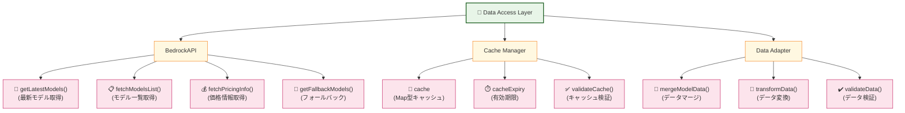

## データフロー

### 1. 初期化フロー
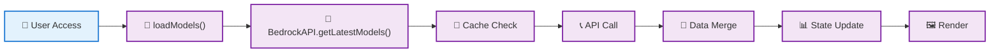

### 2. フィルタリングフロー
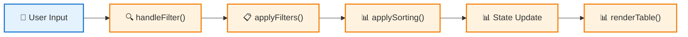

### 3. 比較フロー
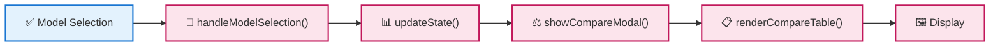

### 4. 更新フロー
```mermaid
flowchart LR
    UB["🔄 Update Button"] --> UM["🔄 updateModels()"]
    UM --> CC["🗑️ Cache Clear"]
    CC --> AC["📞 API Call"]
    AC --> DM["🔗 Data Merge"]
    DM --> SU["📊 State Update"]
    SU --> R["🖼️ Render"]
    R --> N["📢 Notification"]
    
    classDef user fill:#e3f2fd,stroke:#1976d2,stroke-width:2px
    classDef process fill:#e8f5e8,stroke:#2e7d32,stroke-width:2px
    classDef notification fill:#fff8e1,stroke:#f9a825,stroke-width:2px
    
    class UB user
    class UM,CC,AC,DM,SU,R process
    class N notification
```

## 状態管理アーキテクチャ

### 状態構造
```javascript
appState = {
  // データ状態
  models: [],              // 全モデルデータ（80+モデル）
  filteredModels: [],      // フィルタ済みデータ
  selectedModels: [],      // 選択中モデル
  
  // UI状態
  filters: {
    provider: 'all',       // 10社プロバイダー対応
    type: 'all',          // 4種類タイプ対応
    price: 'all',         // 価格帯フィルタ
    search: ''            // リアルタイム検索
  },
  sortBy: 'name',         // ソート基準
  sortOrder: 'asc',       // ソート順序
  
  // 新機能状態
  currency: 'USD',        // 通貨設定（USD/JPY）
  exchangeRate: 150,      // USD→JPY換算レート
  theme: 'light',         // テーマ設定（light/dark）
  
  // システム状態
  loading: false,
  error: null,
  lastUpdated: null
}
```

### 状態更新パターン
- **Immutable Updates**: 状態の不変性を保持
- **Single Source of Truth**: appStateが唯一の真実の源
- **Reactive Updates**: 状態変更時の自動UI更新

## セキュリティアーキテクチャ

### データ保護
- **XSS対策**: DOM操作時のサニタイゼーション
- **CSP**: Content Security Policy適用
- **HTTPS**: 本番環境での暗号化通信

### プライバシー
- **ローカル処理**: 機密データはクライアント内で処理
- **キャッシュ管理**: 適切な有効期限設定
- **ログ制御**: 機密情報のログ出力制限

## パフォーマンスアーキテクチャ

### 最適化戦略
- **レイジーローディング**: 必要時のみデータ取得
- **キャッシュ戦略**: 24時間のメモリキャッシュ
- **仮想化**: 大量データの効率的表示
- **デバウンス**: 検索入力の最適化

### メモリ管理
- **ガベージコレクション**: 不要オブジェクトの適切な解放
- **イベントリスナー**: 適切なクリーンアップ
- **DOM操作**: 効率的な要素更新

## 拡張性アーキテクチャ

### モジュラー設計
- **疎結合**: 各レイヤーの独立性
- **インターフェース**: 明確なAPI定義
- **プラグイン**: 機能の追加・削除容易性

### 将来拡張ポイント
- **新データソース**: 他クラウドプロバイダー対応（Azure OpenAI, Google Vertex AI）
- **新機能**: リアルタイム価格更新、性能ベンチマーク
- **新UI**: PWA化、ネイティブアプリ化
- **新分析**: 使用統計・レコメンデーション、コスト計算機
- **国際化**: 多言語対応（英語・中国語）
- **統合**: AWS Console統合、実際のモデル呼び出し機能

## ドキュメント設計アーキテクチャ

### Mermaid Chart システム
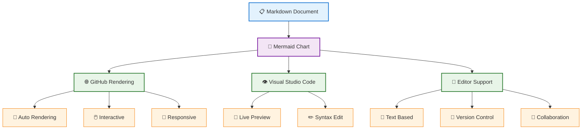

## v1.5.1 新機能アーキテクチャ

### 1. ダークモード実装
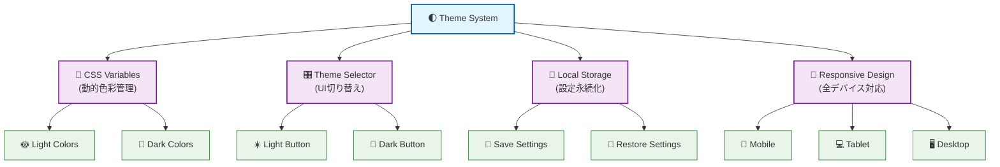

### 2. 通貨切り替えシステム
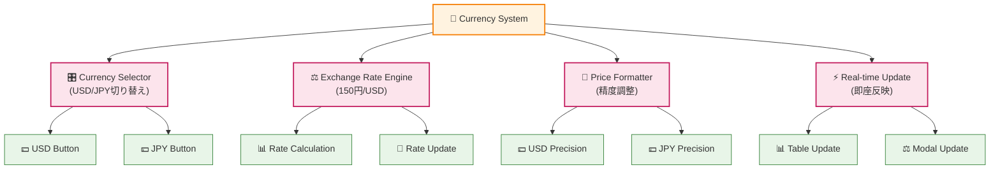

### 3. 拡張モデル管理
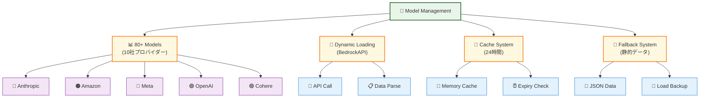

### 4. 高度なレスポンシブ設計
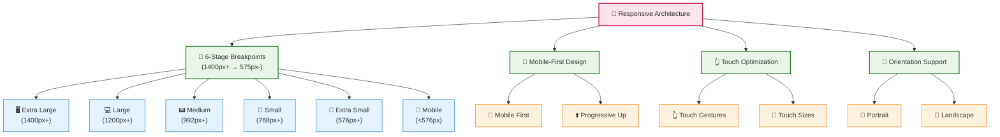